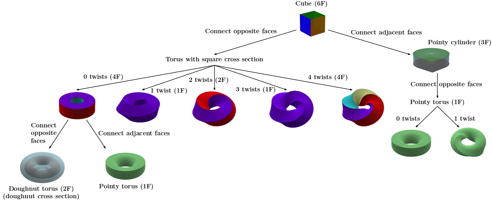

# Mobius Torus Visualization

An interactive 3D visualization of a various shapes torus with a polygonal cross-section and variable twist (+ other shapes).

The number of distinct faces (i.e., colors) is the GCD of the number of the faces of the cross-section and the number of face twists in a 360 degree torus rotation.

Built the first version with 'vibe coding'. You can see the exact sequence of prompts used in vibe_coding.md. You can also see some of the intermediate states so you can see the evolution.

## Other shapes

